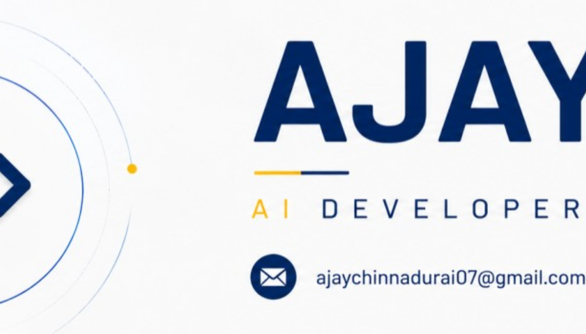

<div align="center">



### 🧠 AI Developer • Builder • Learner

**I build practical AI systems with Python, Machine Learning & Generative AI.**

<a href="https://www.linkedin.com/in/ajay-c-03a707286">
  
</a>
<a href="mailto:ajaychinnadurai07@gmail.com">
  
</a>

</div>

---

## ⚡ CURRENTLY BUILDING

<table>
<tr>
<td width="50%" valign="top">

### 🎙 Automated Telephony AI

An AI-powered voice assistant focused on customer-service conversations, knowledge retrieval and answer verification.

**Exploring:** `RAG` · `LLMs` · `Voice AI` · `Knowledge Engines`

</td>
<td width="50%" valign="top">

### 🌾 AI for Agriculture

Exploring practical AI solutions that can support farmers through mobile-first tools and intelligent decision support.

**Exploring:** `AI` · `Data` · `Mobile` · `Automation`

</td>
</tr>
</table>

---

## 🚀 SELECTED PROJECTS

<table>
<tr>
<td width="50%" valign="top">

### 🤖 AI Virtual Mouse
Computer-vision based interaction using hand tracking.

`Python` `OpenCV` `MediaPipe`

</td>
<td width="50%" valign="top">

### 🚁 Autonomous Drone Delivery
AI-assisted concept for autonomous e-commerce product delivery.

`Python` `AI` `Optimization`

</td>
</tr>
<tr>
<td width="50%" valign="top">

### 📈 Real-Time Stock Analysis
Financial data analysis and prediction experiments using machine learning.

`Python` `LSTM` `Data Science`

</td>
<td width="50%" valign="top">

### 👁 AI CCTV / Vision Systems
Computer-vision experiments involving detection, tracking and intelligent monitoring.

`Python` `OpenCV` `YOLO`

</td>
</tr>
</table>

---

## 🧩 WHAT I WORK WITH

<div align="center">


<br><br>


</div>

---

## 🧭 MY AI JOURNEY

```text
DATA SCIENCE
     │
     ▼
MACHINE LEARNING
     │
     ▼
DEEP LEARNING
     │
     ▼
COMPUTER VISION ───────► REAL-WORLD AI SYSTEMS
     │
     ▼
GENERATIVE AI ─────────► RAG / LLM APPLICATIONS
     │
     ▼
VOICE AI & AI AGENTS
     │
     ▼
REINFORCEMENT LEARNING
     │
     ▼
MULTI-AGENT SYSTEMS
```

---

## 🔬 CURRENTLY EXPLORING

<div align="center">

`Reinforcement Learning` &nbsp; `RAG` &nbsp; `LLM Applications` &nbsp; `AI Agents`  
`Voice AI` &nbsp; `Computer Vision` &nbsp; `Multi-Agent Systems`

</div>

---

## 📊 GITHUB ACTIVITY

<div align="center">


<br>


</div>

---

## 🏗️ HOW I BUILD

<div align="center">

**IDEA** → **RESEARCH** → **BUILD** → **TEST** → **ITERATE** → **DEPLOY**

</div>

I prefer learning by building: taking an idea, turning it into a working prototype, finding the weaknesses, and improving it.

---

## 🎯 2026 FOCUS

<table>
<tr>
<td align="center">🧠<br><b>AI Research</b></td>
<td align="center">🤖<br><b>AI Agents</b></td>
<td align="center">🎙️<br><b>Voice AI</b></td>
<td align="center">📚<br><b>RL</b></td>
<td align="center">🚀<br><b>Product Building</b></td>
</tr>
</table>

---

<div align="center">

### 💡 BUILD → TEST → LEARN → REPEAT


</div>
